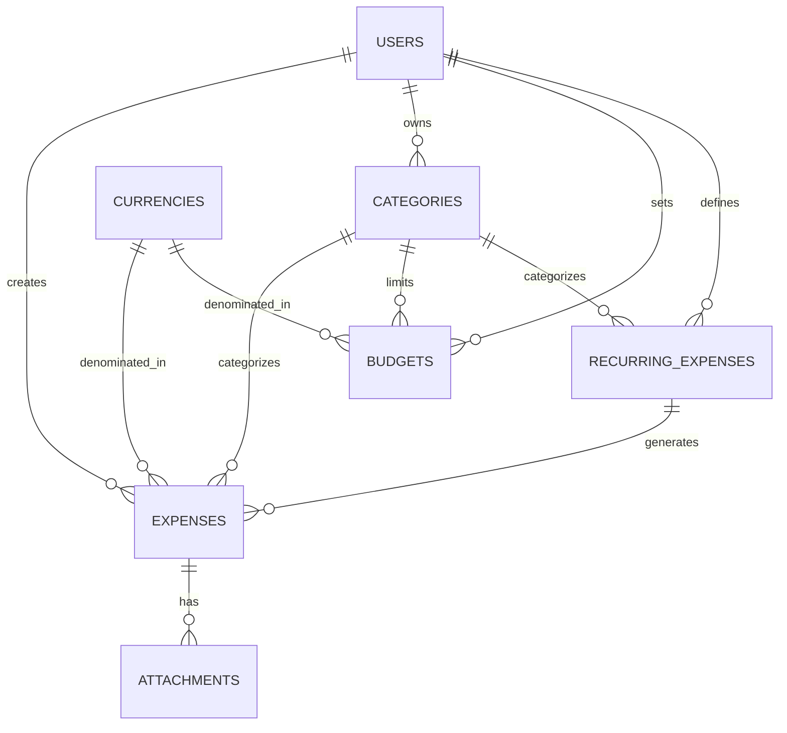

# Expense Tracker Database Design Sketch

## Overview
This document outlines the relational database design for the Expense Tracker application based on the business requirements document.

## Database Schema Design

### Core Entities and Relationships



## Table Structures

### 1. USERS Table
Primary entity for user management and authentication.

| Column | Type | Constraints | Description |
|--------|------|-------------|-------------|
| user_id | UUID | PRIMARY KEY | Unique user identifier |
| email | VARCHAR(255) | UNIQUE, NOT NULL | User email address |
| password_hash | VARCHAR(255) | NOT NULL | Encrypted password |
| first_name | VARCHAR(100) | NOT NULL | User's first name |
| last_name | VARCHAR(100) | NOT NULL | User's last name |
| phone | VARCHAR(20) | NULL | Optional phone number |
| preferred_currency | VARCHAR(3) | NOT NULL, DEFAULT 'EUR' | ISO currency code |
| subscription_type | ENUM | NOT NULL, DEFAULT 'free' | 'free' or 'premium' |
| timezone | VARCHAR(50) | NOT NULL, DEFAULT 'UTC' | User's timezone |
| language | VARCHAR(5) | NOT NULL, DEFAULT 'en' | Language preference |
| biometric_enabled | BOOLEAN | DEFAULT FALSE | Biometric auth enabled |
| created_at | TIMESTAMP | NOT NULL, DEFAULT NOW() | Account creation date |
| updated_at | TIMESTAMP | NOT NULL, DEFAULT NOW() | Last update |
| last_login | TIMESTAMP | NULL | Last login timestamp |
| is_active | BOOLEAN | DEFAULT TRUE | Account status |

### 2. CURRENCIES Table
Reference table for supported currencies.

| Column | Type | Constraints | Description |
|--------|------|-------------|-------------|
| currency_code | VARCHAR(3) | PRIMARY KEY | ISO 4217 currency code |
| currency_name | VARCHAR(100) | NOT NULL | Full currency name |
| symbol | VARCHAR(10) | NOT NULL | Currency symbol |
| decimal_places | INTEGER | NOT NULL, DEFAULT 2 | Decimal precision |
| is_active | BOOLEAN | DEFAULT TRUE | Currency availability |

### 3. CATEGORIES Table
Expense categorization system.

| Column | Type | Constraints | Description |
|--------|------|-------------|-------------|
| category_id | UUID | PRIMARY KEY | Unique category identifier |
| user_id | UUID | FOREIGN KEY → USERS | Category owner |
| name | VARCHAR(100) | NOT NULL | Category name |
| description | TEXT | NULL | Optional description |
| icon | VARCHAR(50) | NULL | Icon identifier |
| color | VARCHAR(7) | NULL | Hex color code |
| is_default | BOOLEAN | DEFAULT FALSE | System default category |
| parent_category_id | UUID | FOREIGN KEY → CATEGORIES | For subcategories |
| sort_order | INTEGER | DEFAULT 0 | Display order |
| is_active | BOOLEAN | DEFAULT TRUE | Category status |
| created_at | TIMESTAMP | NOT NULL, DEFAULT NOW() | Creation date |
| updated_at | TIMESTAMP | NOT NULL, DEFAULT NOW() | Last update |

### 4. EXPENSES Table
Core expense transaction records.

| Column | Type | Constraints | Description |
|--------|------|-------------|-------------|
| expense_id | UUID | PRIMARY KEY | Unique expense identifier |
| user_id | UUID | FOREIGN KEY → USERS | Expense owner |
| category_id | UUID | FOREIGN KEY → CATEGORIES | Expense category |
| recurring_expense_id | UUID | FOREIGN KEY → RECURRING_EXPENSES | If from recurring |
| amount | DECIMAL(15,4) | NOT NULL, CHECK > 0 | Expense amount |
| currency_code | VARCHAR(3) | FOREIGN KEY → CURRENCIES | Expense currency |
| amount_in_base_currency | DECIMAL(15,4) | NOT NULL | Amount in user's preferred currency |
| exchange_rate | DECIMAL(10,6) | DEFAULT 1.0 | Exchange rate used |
| description | TEXT | NULL | Optional description |
| expense_date | DATE | NOT NULL | Date of expense |
| location | VARCHAR(255) | NULL | Where expense occurred |
| payment_method | ENUM | NULL | 'cash', 'card', 'bank_transfer', 'digital' |
| merchant | VARCHAR(255) | NULL | Merchant/vendor name |
| receipt_number | VARCHAR(100) | NULL | Receipt reference |
| tags | TEXT[] | NULL | Array of tags |
| is_tax_deductible | BOOLEAN | DEFAULT FALSE | Tax deductibility flag |
| notes | TEXT | NULL | Additional notes |
| created_at | TIMESTAMP | NOT NULL, DEFAULT NOW() | Creation timestamp |
| updated_at | TIMESTAMP | NOT NULL, DEFAULT NOW() | Last update |

### 5. ATTACHMENTS Table
File attachments for expenses (receipts, photos).

| Column | Type | Constraints | Description |
|--------|------|-------------|-------------|
| attachment_id | UUID | PRIMARY KEY | Unique attachment identifier |
| expense_id | UUID | FOREIGN KEY → EXPENSES | Related expense |
| file_name | VARCHAR(255) | NOT NULL | Original file name |
| file_path | VARCHAR(500) | NOT NULL | Storage path/URL |
| file_size | BIGINT | NOT NULL | File size in bytes |
| mime_type | VARCHAR(100) | NOT NULL | File MIME type |
| uploaded_at | TIMESTAMP | NOT NULL, DEFAULT NOW() | Upload timestamp |

### 6. BUDGETS Table
Budget management for categories and overall spending.

| Column | Type | Constraints | Description |
|--------|------|-------------|-------------|
| budget_id | UUID | PRIMARY KEY | Unique budget identifier |
| user_id | UUID | FOREIGN KEY → USERS | Budget owner |
| category_id | UUID | FOREIGN KEY → CATEGORIES | Category (NULL for total budget) |
| budget_type | ENUM | NOT NULL | 'monthly', 'weekly', 'yearly' |
| amount | DECIMAL(15,4) | NOT NULL, CHECK > 0 | Budget amount |
| currency_code | VARCHAR(3) | FOREIGN KEY → CURRENCIES | Budget currency |
| start_date | DATE | NOT NULL | Budget period start |
| end_date | DATE | NOT NULL | Budget period end |
| alert_percentage | INTEGER | DEFAULT 80 | Alert threshold (%) |
| is_active | BOOLEAN | DEFAULT TRUE | Budget status |
| created_at | TIMESTAMP | NOT NULL, DEFAULT NOW() | Creation date |
| updated_at | TIMESTAMP | NOT NULL, DEFAULT NOW() | Last update |

### 7. RECURRING_EXPENSES Table
Template for recurring/scheduled expenses.

| Column | Type | Constraints | Description |
|--------|------|-------------|-------------|
| recurring_id | UUID | PRIMARY KEY | Unique recurring expense identifier |
| user_id | UUID | FOREIGN KEY → USERS | Owner |
| category_id | UUID | FOREIGN KEY → CATEGORIES | Category |
| amount | DECIMAL(15,4) | NOT NULL, CHECK > 0 | Recurring amount |
| currency_code | VARCHAR(3) | FOREIGN KEY → CURRENCIES | Currency |
| description | TEXT | NOT NULL | Description template |
| frequency | ENUM | NOT NULL | 'daily', 'weekly', 'monthly', 'yearly' |
| interval_value | INTEGER | NOT NULL, DEFAULT 1 | Every X periods |
| start_date | DATE | NOT NULL | First occurrence |
| end_date | DATE | NULL | Last occurrence (NULL = indefinite) |
| next_due_date | DATE | NOT NULL | Next scheduled date |
| auto_create | BOOLEAN | DEFAULT TRUE | Auto-create expenses |
| is_active | BOOLEAN | DEFAULT TRUE | Recurring status |
| created_at | TIMESTAMP | NOT NULL, DEFAULT NOW() | Creation date |
| updated_at | TIMESTAMP | NOT NULL, DEFAULT NOW() | Last update |

### 8. BUDGET_ALERTS Table
Alert history and tracking.

| Column | Type | Constraints | Description |
|--------|------|-------------|-------------|
| alert_id | UUID | PRIMARY KEY | Unique alert identifier |
| budget_id | UUID | FOREIGN KEY → BUDGETS | Related budget |
| alert_type | ENUM | NOT NULL | 'warning', 'exceeded' |
| threshold_percentage | INTEGER | NOT NULL | Percentage that triggered alert |
| current_spent | DECIMAL(15,4) | NOT NULL | Amount spent when alert fired |
| budget_amount | DECIMAL(15,4) | NOT NULL | Budget amount at alert time |
| alert_date | TIMESTAMP | NOT NULL, DEFAULT NOW() | When alert was triggered |
| is_acknowledged | BOOLEAN | DEFAULT FALSE | User acknowledged |

### 9. EXCHANGE_RATES Table
Historical exchange rates for currency conversion.

| Column | Type | Constraints | Description |
|--------|------|-------------|-------------|
| rate_id | UUID | PRIMARY KEY | Unique rate identifier |
| from_currency | VARCHAR(3) | FOREIGN KEY → CURRENCIES | Source currency |
| to_currency | VARCHAR(3) | FOREIGN KEY → CURRENCIES | Target currency |
| rate | DECIMAL(10,6) | NOT NULL | Exchange rate |
| rate_date | DATE | NOT NULL | Rate validity date |
| created_at | TIMESTAMP | NOT NULL, DEFAULT NOW() | Rate fetch timestamp |

## Indexes for Performance

### Primary Indexes (Automatic with PKs/FKs)
- All primary keys have clustered indexes
- All foreign keys have non-clustered indexes

### Additional Performance Indexes
```sql
-- Expense queries by user and date range
CREATE INDEX idx_expenses_user_date ON expenses(user_id, expense_date DESC);

-- Category-based expense queries
CREATE INDEX idx_expenses_category_date ON expenses(category_id, expense_date DESC);

-- Budget period queries
CREATE INDEX idx_budgets_user_period ON budgets(user_id, start_date, end_date);

-- Recurring expense scheduling
CREATE INDEX idx_recurring_next_due ON recurring_expenses(next_due_date, is_active);

-- Currency conversion lookups
CREATE INDEX idx_exchange_rates_lookup ON exchange_rates(from_currency, to_currency, rate_date DESC);

-- Text search on expense descriptions
CREATE INDEX idx_expenses_description_text ON expenses USING gin(to_tsvector('english', description));
```

## Business Rules Implementation

### Database Constraints
```sql
-- BR-001: Expenses cannot have negative amounts
ALTER TABLE expenses ADD CONSTRAINT chk_positive_amount CHECK (amount > 0);

-- BR-002: Expense date cannot be more than 1 day in future
ALTER TABLE expenses ADD CONSTRAINT chk_expense_date 
    CHECK (expense_date <= CURRENT_DATE + INTERVAL '1 day');

-- BR-004: Budgets cannot be negative
ALTER TABLE budgets ADD CONSTRAINT chk_positive_budget CHECK (amount > 0);

-- Budget periods must be valid
ALTER TABLE budgets ADD CONSTRAINT chk_valid_period CHECK (end_date > start_date);

-- Exchange rates must be positive
ALTER TABLE exchange_rates ADD CONSTRAINT chk_positive_rate CHECK (rate > 0);
```

### Triggers for Business Logic
```sql
-- Update expense amount in base currency when exchange rate changes
-- Auto-update recurring expense next_due_date
-- Trigger budget alerts when thresholds are exceeded
-- Update user.updated_at on any profile change
```

## Data Volume Estimates

### Year 1 Projections (100K users)
- Users: 100,000 records
- Expenses: ~12M records (avg 10 expenses/user/month)
- Categories: ~500K records (5 custom categories/user)
- Budgets: ~1.2M records (1 budget/category/month)
- Attachments: ~6M records (50% of expenses have receipts)

### Storage Requirements
- Expenses table: ~2GB
- Attachments metadata: ~500MB
- File storage: ~500GB (assuming 100KB avg file size)
- Total database: ~5GB

## Security Considerations

### Data Encryption
- Sensitive financial data encrypted at rest
- Password hashing using bcrypt/Argon2
- Personal data pseudonymization for analytics

### Access Control
- Row-level security for multi-tenant data isolation
- API access through application layer only
- Audit logging for all data modifications

### GDPR Compliance
- User data export functionality
- Right to be forgotten implementation
- Data retention policies (5 years as per BR-007)

## Backup and Recovery Strategy

### Backup Schedule
- Full backup: Weekly
- Incremental backup: Daily
- Transaction log backup: Every 15 minutes

### Recovery Objectives
- RTO (Recovery Time Objective): 4 hours
- RPO (Recovery Point Objective): 15 minutes

This design supports all functional requirements while maintaining performance, security, and scalability for the expense tracker application.
